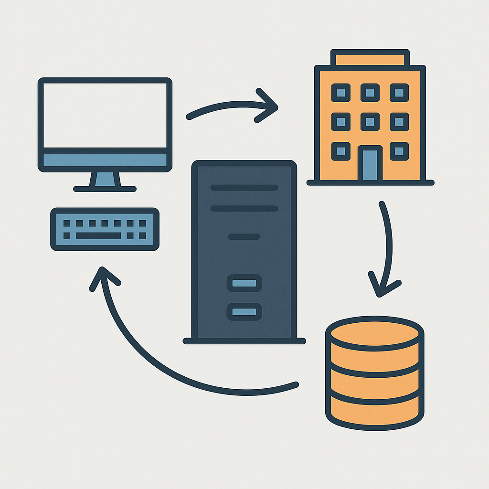

# AI-иллюстрации по тегам в Markdown

Инструмент генерирует картинки для глав книги по спец-комментариям в Markdown и сам вставляет
`` рядом с ними. Работает через GitHub Actions при push в репозиторий.

## Синтаксис тегов

### Простая форма

```markdown
Текст абзаца, который станет контекстом для картинки.

<!-- ai-image: event-loop -->

```

`event-loop` — это `id`. Он же станет именем файла: `technical/media/event-loop.png`.

### Сложная форма (с деталями промпта)

```markdown
Текст абзаца, который станет контекстом для картинки.

<!-- ai-image
id: event-loop
kind: architecture
style: hand-drawn
instruction: emphasize the boundary between JS runtime and browser APIs
alt: How the event loop works
-->

```

Поддерживаемые поля: `id` (обязательное), `kind`, `style`, `instruction`, `alt` (необязательные).
`alt` задаёт текст ``; если не указан, используется `id`, преобразованный в Title Case
(`event-loop` → `Event Loop`).

### Контекст для генерации

Инструмент берёт ближайший абзац текста **над** тегом (до пустой строки или заголовка) и передаёт
его вместе с `kind`/`style`/`instruction` в промпт. Другие `<!-- ai-image -->` теги и уже вставленные
картинки при поиске контекста пропускаются — они не попадают в промпт как "текст книги".

## Что происходит после push

При push в любую ветку генерируются недостающие/изменённые картинки, и результат всегда оформляется
как pull request в ту же ветку (branch → `ai-images/<ветка>-<sha>`, base → `<ветка>`). Прямых
коммитов в исходную ветку инструмент не делает — правки всегда проходят через PR.

Соответствующий workflow-файл: [`ai-images.yml`](../../.github/workflows/ai-images.yml).

Коммит с сообщением, содержащим `[skip ai-image]` (в том числе автокоммиты самого инструмента),
не запускает повторную генерацию.

## Идемпотентность

Список уже сгенерированных картинок хранится в `technical/media/.ai-image-manifest.json` — для
каждого `id` там лежит хеш от `kind`/`style`/`instruction`/контекста. Если тег не менялся —
картинка не перегенерируется. Если изменить, например, `instruction`, — хеш не совпадёт, и
картинка будет пересоздана.

## Локальный запуск

```bash
# сухой прогон — вместо реального вызова API создаёт текстовый файл-заглушку
node tools/ai-images/generate.mjs --file chapter01.md --dry-run

# по конкретным файлам, с реальной генерацией (нужен OPENAI_API_KEY в окружении)
OPENAI_API_KEY=sk-... node tools/ai-images/generate.mjs --file chapter01.md

# по диапазону коммитов (так же вызывается workflow)
node tools/ai-images/generate.mjs --base <sha-до> --head <sha-после>
```

Юнит-тесты парсера тегов:

```bash
npm test
```

## Настройка репозитория

В Settings → Secrets and variables → Actions нужно добавить секрет `OPENAI_API_KEY` — без него шаг
генерации в CI будет падать (кроме `--dry-run`).

## Устранение неполадок

- **Картинка не появилась после push** — проверьте, что push попал именно в ветку, а не только
  закоммичен локально; workflow видит только то, что реально запушено в GitHub.
- **Картинка перегенерируется на каждый push, хотя тег не менялся** — проверьте, что абзац-контекст
  над тегом действительно не менялся между коммитами (хеш зависит и от него).
- **Workflow падает на шаге генерации** — скорее всего не задан секрет `OPENAI_API_KEY`.
